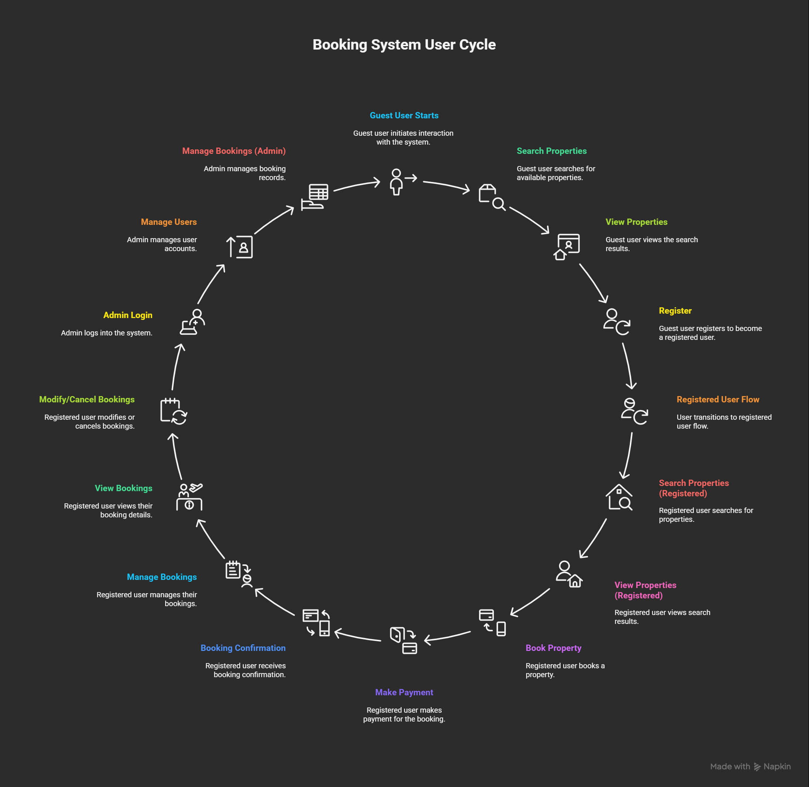

# Requirement Analysis in Software Development.

This repository explores the process and importance of Requirement Analysis in the Software Development Life Cycle (SDLC). It aims to provide a structured understanding of how to gather, document, analyze, and validate software requirements to ensure successful project outcomes. The contents of this repository highlight key activities such as requirement gathering, elicitation, documentation, modeling, and validation—serving as a practical reference for both learners and developers looking to build clear, user-centered software systems.

## What is Requirement Analysis?

**Requirement Analysis** is a crucial phase in the **Software Development Life Cycle (SDLC)** where project teams work to identify, gather, and define the needs and expectations of stakeholders for a new or improved software system. The goal is to ensure that everyone — from clients to developers — has a shared understanding of what the system should do, how it should behave, and the constraints it must operate within.

During this phase, business analysts and developers collaborate with end users to translate business needs into **clear, measurable, and actionable requirements**. These requirements serve as the foundation for system design, development, and testing, ensuring that the final product meets both functional and non-functional expectations.

### Importance of Requirement Analysis

- **Clarity and Alignment:** Ensures all stakeholders have a common understanding of the system’s goals and features.  
- **Reduced Ambiguity:** Minimizes misunderstandings and costly rework during later stages of development.  
- **Scope Definition:** Clearly defines what is included and excluded from the project, preventing scope creep.  
- **Improved Planning:** Helps estimate cost, resources, and timelines more accurately.  
- **Quality Assurance:** Ensures that the final product aligns with user needs and achieves high customer satisfaction.

In essence, Requirement Analysis lays the groundwork for successful software projects by turning vague ideas into well-defined solutions.

## Why is Requirement Analysis Important?

Requirement Analysis plays a vital role in the **Software Development Life Cycle (SDLC)** because it sets the direction for all subsequent phases of the project. A well-conducted analysis helps ensure that the final product meets user expectations, stays within scope, and delivers real business value. Below are key reasons why Requirement Analysis is essential:

### 1. Ensures Clarity and Understanding  
It helps the development team and stakeholders establish a shared understanding of the project’s objectives and requirements. This reduces ambiguity, miscommunication, and rework later in the development process.

### 2. Defines the Project Scope  
By clearly identifying what the system should and shouldn’t do, Requirement Analysis prevents **scope creep** — the gradual expansion of project goals that can lead to missed deadlines, cost overruns, and project failure.

### 3. Provides a Foundation for Design and Development  
The documented requirements serve as a **blueprint** for developers and designers. It ensures that every feature, function, and behavior of the system aligns with business goals and user needs.

### 4. Improves Cost and Time Estimation  
When requirements are well-defined, teams can more accurately estimate the time, effort, and resources needed for development, leading to better project planning and risk management.

### 5. Enhances Quality and Customer Satisfaction  
Well-analyzed and validated requirements ensure that the end product performs as expected, meets user needs, and delivers a high-quality experience — resulting in greater stakeholder satisfaction.

## Key Activities in Requirement Analysis

Requirement Analysis involves several structured activities that help identify, define, and validate what a software system should do. These activities ensure that all requirements are clear, feasible, and aligned with stakeholder expectations.

### 1. Requirement Gathering 🗂️
- Collects detailed information from stakeholders about their needs and expectations.  
- Common techniques include **interviews**, **surveys**, **workshops**, **observation**, and **document analysis**.  
- Helps in forming the foundation for all subsequent activities in the analysis process.

### 2. Requirement Elicitation ✍️
- Focuses on refining and clarifying the gathered information.  
- Techniques include **brainstorming sessions**, **focus groups**, and **prototyping** to uncover hidden requirements.  
- Ensures that all stakeholders have a shared understanding of the system’s objectives.

### 3. Requirement Documentation 📚
- Involves writing detailed and structured descriptions of both functional and non-functional requirements.  
- Common formats include **Software Requirement Specification (SRS)** documents, **user stories**, and **use case diagrams**.  
- Serves as the official reference for designers, developers, and testers.

### 4. Requirement Analysis and Modeling 📊
- Analyzes, prioritizes, and validates the gathered requirements to ensure feasibility and alignment with project goals.  
- Uses models such as **data flow diagrams (DFD)**, **entity-relationship diagrams (ERD)**, and **use case models** to visualize and understand system behavior.  
- Helps in identifying dependencies, conflicts, and technical constraints.

### 5. Requirement Validation ✅
- Ensures that the documented requirements accurately represent stakeholder needs.  
- Involves **reviews**, **walkthroughs**, and **acceptance criteria** definition.  
- Establishes **traceability matrices** to confirm that each requirement is addressed during design, development, and testing.

---

Together, these activities form the backbone of a successful requirement analysis process, ensuring that the final product meets user expectations and business goals.

## Types of Requirements

In software development, requirements are broadly categorized into **Functional** and **Non-functional** requirements.  
Both are essential to define **what** the system should do and **how** it should perform.

---

### 🧩 Functional Requirements

**Definition:**  
Functional requirements specify the core operations and behaviors that the system must perform.  
They describe *what* the system should do in response to user interactions or specific conditions.

**Examples for a Property Booking Management System:**
- **User Registration:** Users should be able to create an account with personal details and login credentials.  
- **Property Search:** Users can search for properties using filters such as location, price, and availability.  
- **Booking System:** Users should be able to select dates, confirm bookings, and view their booking history.  
- **User Authentication:** Secure login and logout functionalities must be implemented.  
- **Property Listings:** Display properties with images, descriptions, and pricing details.  
- **Payment Integration:** Allow users to complete bookings through supported payment gateways.  

These requirements define the **core functionality** of the system that directly interacts with users.

---

### ⚙️ Non-functional Requirements

**Definition:**  
Non-functional requirements define *how* the system should perform its functions.  
They focus on the system’s quality attributes such as performance, security, scalability, and usability.

**Examples for a Property Booking Management System:**
- **Performance:** Pages should load within 2 seconds, even with up to 1000 concurrent users.  
- **Security:** Implement data encryption, secure login mechanisms, and protect against vulnerabilities like SQL injection.  
- **Scalability:** The system must be capable of handling growth in user traffic and database size without performance degradation.  
- **Usability:** The interface should be user-friendly, intuitive, and responsive across devices.  
- **Reliability:** The system should have a minimum uptime of 99.9% and include automated backup and recovery mechanisms.  
- **Maintainability:** The codebase should follow best practices for modularity and documentation to simplify future updates.

---

Functional and non-functional requirements work together to ensure that the system not only meets user needs but also performs efficiently and reliably under real-world conditions.

## Use Case Diagrams

### 🧠 What are Use Case Diagrams?
Use Case Diagrams are visual representations that illustrate how different **users (actors)** interact with a system to achieve specific **goals (use cases)**.  
They form an essential part of Requirement Analysis by helping teams understand **system functionality** from a user’s perspective.

---

### 🎯 Benefits of Use Case Diagrams
- **Clarifies Functional Requirements:** Shows what the system should do from the user’s point of view.  
- **Improves Communication:** Bridges the gap between stakeholders, developers, and testers by providing a simple visual overview.  
- **Identifies Actors and Interactions:** Helps identify all the user roles and their interactions with different system components.  
- **Supports Design and Testing:** Serves as a foundation for creating test cases and designing the system architecture.

---

### 🧩 Use Case Diagram for Booking Management System

Below is an example of a **Use Case Diagram** for the *Property Booking Management System* that visualizes the main interactions between users and the system.

#### **Actors:**
- **Guest:** Can browse and search for properties.  
- **Registered User:** Can book, view, and manage bookings.  
- **Admin:** Manages property listings and oversees user activities.

#### **Use Cases:**
- Search for properties  
- View property details  
- Register / Login  
- Book property  
- Manage bookings  
- Add or remove listings (Admin)  
- Approve or cancel bookings (Admin)

---

### 🖼️ Use Case Diagram
Below is the visual representation of the use case diagram:

---

This diagram provides a clear overview of **how users interact with the system**, ensuring that developers understand the **core functionalities** and relationships before moving into design and implementation.
